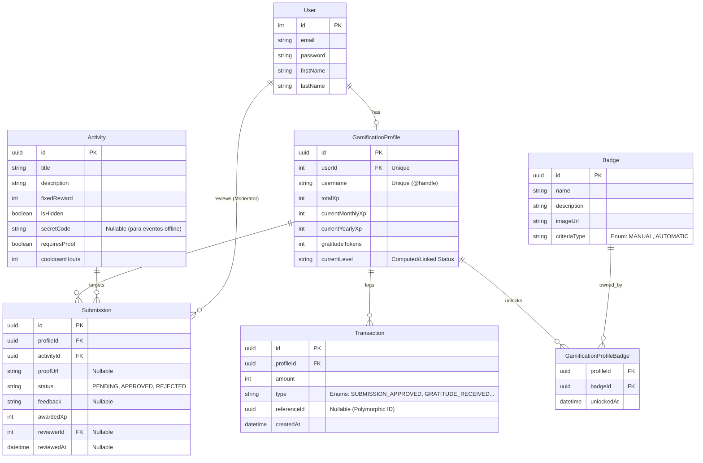

# Modelagem de Dados (Engajamento & Gamificação)

Esta modelagem reflete o ecossistema do MVP para suportar a gamificação via TypeORM sem sujar a tabela global de autenticação `User`.

## Diagrama ER (Mermaid)

## Dicionário de Entidades

### `User` (Autenticação Base - Já Existente)
Focado estritamente na identidade digital do membro dentro da plataforma.

### `GamificationProfile` (Perfil e Carteira do Usuário)
A representação gamificada do membro da comunidade Devs Tocantins.
- `id` (UUID)
- `userId` (Int, FK -> User, Unique)
- `username` (String, Unique) - _@handle_ do usuário para facilitar a busca, menções e transferência de tokens.
- `totalXp` (Int) - XP histórico (Rank Global).
- `currentMonthlyXp` (Int) - XP acumulado no ciclo atual (Rank Mensal).
- `currentYearlyXp` (Int) - XP acumulado no ano (Rank Anual).
- `gratitudeTokens` (Int) - Cota de moedas disponíveis para parabenizar outros colegas na "Economia P2P". (Reseta no dia 1 de cada mês).
- `currentLevel` (String) - Mapeamento em tempo real (ex: Newbie, Junior, Lenda) baseado na progressão do `totalXp`.

### `Activity` (Catalogo Core de Pontuação)
Atividades predefinidas para as quais a comunidade incentiva a realização.
- `id` (UUID)
- `title` (String) - Ex: _"Artigo Publicado"_, _"Ajuda no Discord"_.
- `description` (String)
- `fixedReward` (Int)
- `isHidden` (Boolean) - Permite submissão apenas através de QRCodes secretamente em eventos se setado como `true`.
- `secretCode` (String) - Slug para acesso oculto.
- `requiresProof` (Boolean) - Exige preenchimento obrigatório da `proofUrl` na submissão.
- `cooldownHours` (Int) - Sistema _Anti-Farming_ para o mesmo usuário na mesma atividade.

### `Submission` (A Solicitação / Check-in do Usuário)
Quando o usuário executa uma `Activity` e pede seus pontos.
- `id` (UUID)
- `profileId` (FK) - Relacionado com `GamificationProfile`.
- `activityId` (FK)
- `proofUrl` (String, Nullable) - Link apontando para a evidência do esforço.
- `status` (Enum: `PENDING`, `APPROVED`, `REJECTED`)
- `feedback` (String, Nullable) - Explicação do moderador para a decisão da auditoria.
- `awardedXp` (Int) - Pontos fornecidos (geralmente herda de `Activity.fixedReward`, mas atende missões tipo "curinga").
- `reviewerId` (FK -> User)
- `reviewedAt` (Date)

### `Transaction` (Extrato de Logs Imutáveis)
Motor Financeiro dos Pontos. Todas as mutações no `GamificationProfile` vêm daqui.
- `id` (UUID)
- `profileId` (FK)
- `amount` (Int) - Valores Positivos ou Negativos.
- `type` (Enum: `SUBMISSION_APPROVED`, `GRATITUDE_RECEIVED`, `GRATITUDE_SENT`, `AUDIT_REWARD`, `PENALTY`, `MONTHLY_RESET`)
- `referenceId` (UUID) - Chave estrangeira coringa documentando do que se trata (qual foi a Submission ou a Transaction de quem doou).

### `Badge` e `GamificationProfileBadge` (Conquistas - Adicional MVP)
- `Badge`: Cataloga as medalhas de arte (Nome, Imagem, Descrição Ex: "Corujão do Código").
- `GamificationProfileBadge`: A Tabela associativa Many-To-Many registrando *quando* o usuário destravar as Conquistas Estáticas dele.
